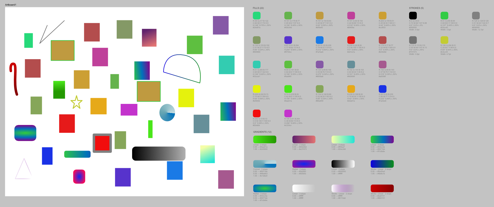
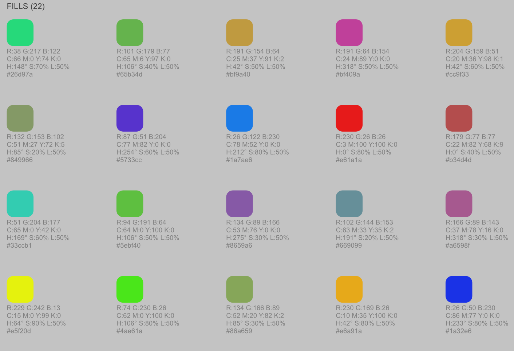
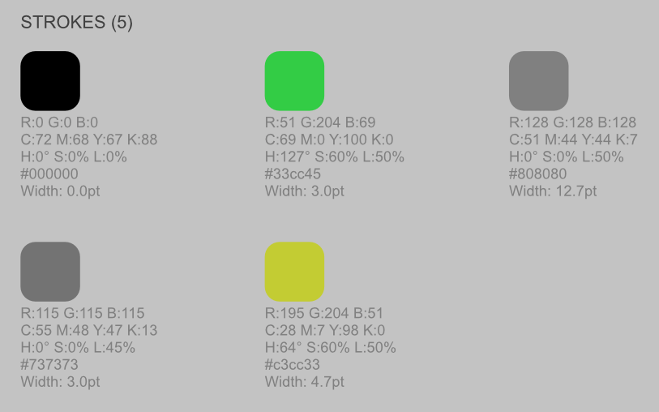
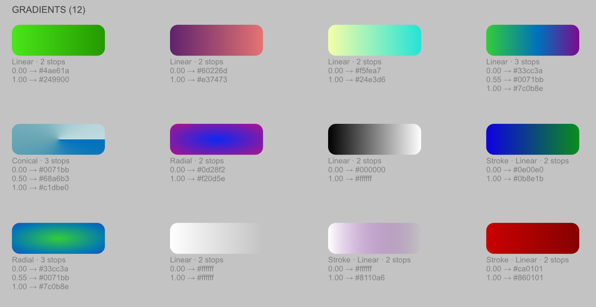

# Color Palette Generator

Script for Affinity that extracts all fill, stroke, and gradient colors from the current page/artboard and displays them as organized swatches.

## Features

- **Fills** — solid colors with RGB, CMYK, HSL, HEX values
- **Strokes** — solid colors with stroke width info
- **Gradients** — linear, elliptical, radial, conical with stop positions

Palette is placed to the right of the spread content, grouped into three labeled sections.

## Screenshot

Fill swatches with RGB, CMYK, HSL, HEX values

Stroke swatches with width info

Gradient swatches with type, stops, and colors

## Usage

Run via MCP Affinity server: `affinity_execute_script` or paste into Script Manager for Affinity.

## Version

9.1.1
